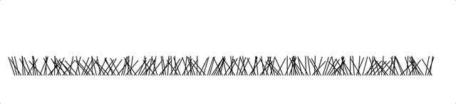

# 算法相关

## 洗牌算法

### 问题描述
如果你想和朋友一起玩扑克游戏，你首先要将牌组随机化，以确保游戏顺利进行。但是怎么做呢？

[CodeChallenge-day1](https://github.com/OutisJie/DayDayUp/tree/master/CodeChallenge-day1)

### solution
这样做的一种简单的方法，是随机的从牌组中拉出一张牌并将其放在一边，重复，逐步建立一个新牌组。只要每次从剩余的牌组中挑选牌的时候，都是相同的概率，就能获得完全无偏的随机牌组：

1. 写下从 1 到 N 的数字
2. 取一个从 1 到剩下的数字（包括这个数字）的随机数 k
3. 从低位开始，得到第 k 个数字（这个数字还没有被取出），把它写在独立的一个列表的最后一位
4. 重复第 2 步，直到所有的数字都被取出
5. 第 3 步写出的这个序列，现在就是原始数字的随机排列

已经证明如果第 2 步取出的数字是真随机的，那么最后得到的排序一定也是。

这个方案存在一个问题，第三步会浪费太多的时间，如果随机到的K已经被取出了,那就需要跳过，重新取随机数。随着被选出来的牌组越来越多，重复率会越来越大，非常耗费时间。

### 改进

1. 随机生成一个数字k(1到n)
2. 交换第k为和第n位元素的值
3. n–-
4. 如果n == 1，则退出循环，这时候list已经被随机排序了，完成算法

```javascript
function shuffle(array) {
  var m = array.length, t, i;

  // While there remain elements to shuffle…
  while (m) {

    // Pick a remaining element…
    i = Math.floor(Math.random() * m--);

    // And swap it with the current element.
    t = array[m];
    array[m] = array[i];
    array[i] = t;
  }

  return array;
}
```


