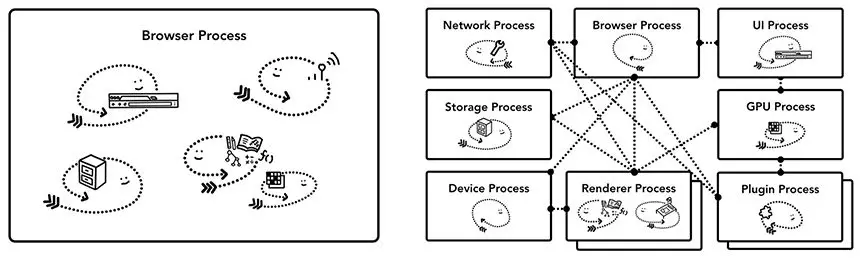

# 浏览器

## 现代浏览器(Chrome)的工作原理（Part1）

在这个博客系列中，我门将事无巨细的深入了解Chrome浏览器的原理，大到Chrome的上层架构，小到Chrome Rendering Pipeline(渲染管道)的具体细节。如果想知道浏览器是如何将代码转换为功能性网站的，或者不知道为什么提出的优化方案是怎么工作的，那么这几篇博客将为你解答。

### CPU, GPU, Memory, and multi-process architecture

在讲浏览器之前，我们先来了解一下有关CPU、GPU、进程和线程。
* [CPU](/learn/os.md#cpu)
* [GPU](/learn/os.md#gpu)
* [进程和线程](/learn/os.md#进程和线程)

