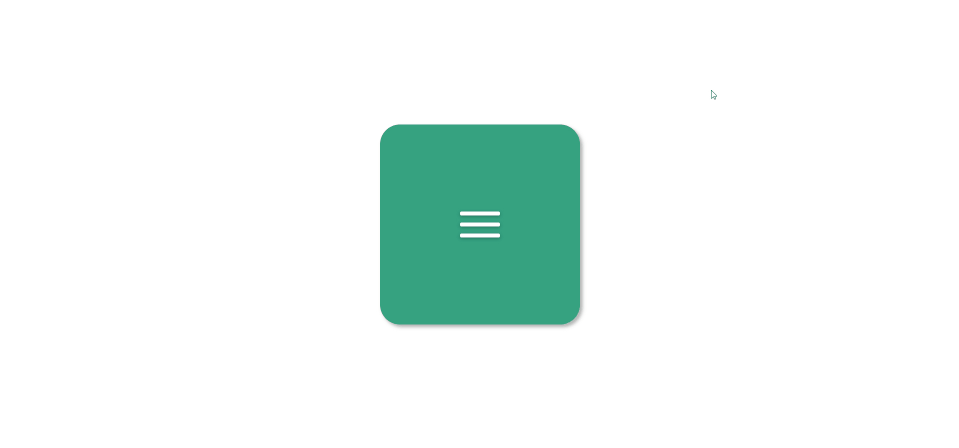
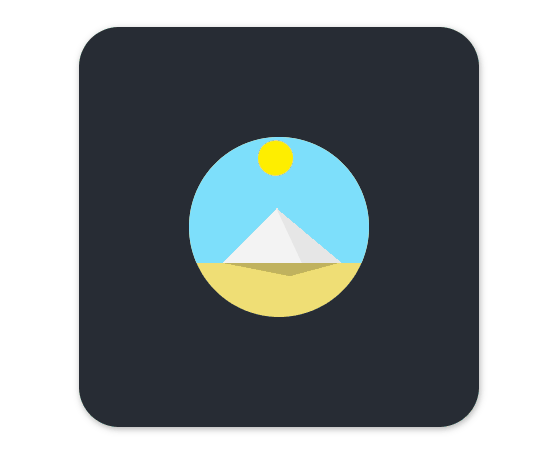

# CSS

css的话，很多东西就跟捡牛粪一样，你一下子看太多根本看不动，看了也会忘掉。平时用到的时候，再去翻一翻，然后下一次再用到，印象就深了，所以这篇我打算做一个CSS Challenge栏目。

## CSSChallenge-day1

先看效果图：

### html
结构上其实蛮简单的，就是两个div，以及三条百杠，我用的是三个span
```html
<body>
    <div class="box">
        <div class="btn not-active">
            <span></span>
            <span></span>
            <span></span>
        </div>
    </div>
</body>
```
### css
```css
.box {
  height: 400px;
  width: 400px;
  background: #3faf82;
  position: absolute;
  top: 50%;
  left: 50%;
  transform: translate(-50%, -50%); // 这个的作用是把元素的起点，也就是左上角，挪到横向-50%，竖向-50%，百分比是自己的宽高
  border-radius: 10%;
  box-shadow: 5px 5px 10px 0 rgba(0, 0, 0, 0.3)
}
/*主要思想就是点击的时候active和not-active切换*/
.active span:nth-child(1) {
  animation: ease 0.7s top-1 forwards; // 这是一个动画效果，top-1是关键帧动画，forward表示动画帧顺序
}

.not-active span:nth-child(1) {
  animation: ease 0.7s top-2 forwards;
}

@keyframes top-1 {
  0% {
    top: 0;
    transform: rotate(0);
  }
  50% {
    top: 22px;
    transform: rotate(0);
  }
  100% {
    top: 22px;
    transform: rotate(45deg);
  }
}
```
具体代码请看：[CSSChallenge-day1](https://github.com/OutisJie/InternShip/tree/master/CSSChallenge-day1)


## CSSChallenge-day2


这个有点复杂，之前看代码吧：[CSSChallenge-day2](https://github.com/OutisJie/InternShip/tree/master/CSSChallenge-day2)

