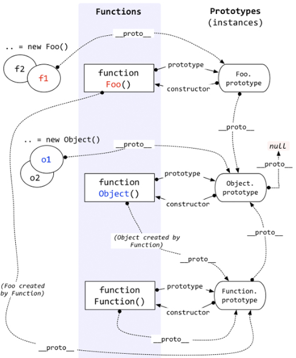

# JS

我觉得 JS（ES6）是一门非常好的语言，不接受反驳 😠。我之所以会喜欢上 JS 是因为它的语法和表现力，它不是最优秀的支持 OO（面向对象）的语言，也不是最优秀的 FP（函数式编程）语言，但我觉得它在两方面兼顾的非常好。

MDN+项目是我主要的学习方式，感觉在 MDN 上看到的都是精华，很吸引人。我最开始也看犀牛书、JS 高级程序设计啥的，但是看的我头疼，一上来讲的都是基础，后面才讲到精华部分，我一个有编程基础的人 🐶🐶 实在耐不住性子，而且在抄别人的代码（说自己从来没抄过代码的人出来挨打 🤨）的时候发现别人都有更新的用法，书的更新速度绝对比不了 MDN 的，所以 MDN 无敌！🌝

## JavaScript 原型链

JS 非常特别，有好几种继承方式，每种方式都有各自的优点，其中原型继承是极具表现力的 OO 方式，非常灵活。先来看看 JS 中的原型链：

### 原型链

首先拿出一张图劝退 🤪：



奶奶的，我看你就是在  为难我胖虎 😭，感觉比我当初学小公举的《一口气全念对》还难，第一次见到的时候，不，我第一次直接跳过了这张图 🌚，当时真的看不懂，我是看了好多遍才搞明白的， 我慢慢讲，争取讲清楚。

---

乍一看这张图，杂乱无章，其实不是的，这图主要是三行三列， 从左往右三列依次是:

**new（ 实例）-> function（构造函数) -> prototypes（原型）**

这是一个是逐渐深入的、渐进的过程、可以比喻成 :

**new（人）-> function（成长过程，包括出生、学习、工作、恋爱等等）-> 复读机（本质）**

是不是很好理解，每一个人，经过社会的洗礼都变得独一无二，但无论是谁，其本质都是复读机 🧐。同样，每一个实例出来的对象，是要经过构造函数的雕琢的，他们的本质都是 `prototypes`。而这里的箭头就是图中的`__proto__`。举一反三，我们再举个例子:

**new (炮姐/gakki/十元/飞鸟/桥本) -> function () -> 老婆（都是我的，拔刀吧）**

进一步理解，某个实例 A 的原型可不可以是别的实例 B 吗？当然可以，只需要通过构造函数就能自己指定实例的原型，我不做人啦！JOJO ～。其实，就算你修改了 A 的 `proto` 的指向，使其指向 B，但是 B 的 `proto` 没有变，你沿着这条路往上走，最终肯定还是复读机，这样一条链路就是**原型链**了。

从上往下三行其实是并行的关系，不可能只有一个最原始的原型，女娲当年造人都有男女之分，JS 也一样，JS 有 **Object.prototype** 和 **Function.prototype** 两个原始对象，它们由引擎生成，分别对应 **function Object()** 和 **function Function()** 两个构造函数， 来构建它们的子类。

### Prototype

有且仅有函数有这个属性，这是一个显示原型属性，基本上所有函数都有，但有一个例外：

```javascript
// 用这个方法创建的函数是不具备prototype属性的, Function.prototype.bind()本身就指向原型。
let fun = Function.prototype.bind();
console.log(fun.prototype); // undefined
```

#### prototype 是怎么产生的：

当我们声明一个函数时，该属性就被自动创建了，而且该熟悉的值是一个对象，也就是原型。原型只有一个显示属性 `constructor` ，并且指向构造函数

```javascript
let foo = function() {};
console.log(foo.prototype); // { constructor: ƒ (), __proto__: Object }，这个就是原型
console.log(foo.prototype.constructor); // ƒ (){}，这个就是函数foo

// 匿名函数不太直观，用有名函数试试
function goo() {}
console.log(goo.prototype); // { constructor: ƒ goo(), __proto__: Object }
```

#### constructor

`constructor` 是一个公有且不可枚举的属性。一旦我们改变了函数的 `prototype` ，那么新对象就没有这个属性了（当然可以通过原型链取到 `constructor`）。

```javascript
foo.prototype = { a: 1 };
console.log(foo.prototype.constructor); // undefined
```

这个属性在大多数情况下都是没有用的，但是，我上面说过构造函数决定了对象实例长成什么样子。如果你想自定义一下某个对象，你可以不用直接修改 `constructor` 的代码，而是用`xx.constructor.method`来扩展

### \_\_proto\_\_

这是每个对象都有的隐式原型属性，指向了**创建该对象的构造函数的原型**。其实这个属性指向了 [[prototype]]，但是 [[prototype]] 是内部属性，我们并不能访问到，所以使用 `_proto_` 来访问。

因为在 JS 中是没有类的概念的，为了实现类似继承的方式，通过 `__proto__` 将对象和原型联系起来组成原型链，得以让对象可以访问到不属于自己的属性。

说到这，有几个特殊情况需要说明:

1. **`Object.prototype.__proto__ === null`**

   Object.prototype 是原型，自然没有 proto，你再循环向上遍历原型链的时候，null 就代表到头了

2. **`Object.__proto__ === Function.prototype`**

   这个上面的图也有一个箭头，因为 Object 是 Function 创建的，那么对象的`__proto__`要指向创建它的构造函数的原型

3. **`Function 的特殊性 Function.__proto__ === Function.prototype`**

   对于对象来说，`xx.__proto__.constructor`是该对象的构造函数，`xx.__proto__`指向其构造函数的原型，但是在图中，我们看到`Function.__proto__ === Function.prototype`，这不就代表 Function 的构造函数是它自己吗，难道是它自己创建了自己？？答案肯定是否定的，我们稍后讨论。

4. **Object.prototype 和 Function.prototype 是由引擎构建的**

#### \_\_proto\_\_是怎么产生的

当我们 new 一个对象时，实例出来的对象就有了\_\_proto\_\_属性。

### new 的过程

除了 Object.prototype 和 Function.prototype 这两个特殊对象，其余都是通过构造器 new 出来的。先来看看 new 的步骤 :

1. 新生成一个对象
2. 将该中间对象的原型`__proto__`指向构造函数的原型`prototype`
3. 将构造函数的 this，绑定到中间对象，并调用
4. 返回该中间对象

```javascript
function create() {
  // 接收一个入参constructor, 以及构造函数所需的入参
  // 创建一个新对象
  let obj = new Object();

  // 取出参数中第一个参数
  let Constructor = [].shift.call(arguments);

  // 将obj的原型指向构造函数的原型，
  // 这样obj可以访问构造函数的原型的属性，实现继承
  obj.__proto__ = Constructor.prototype;

  // 改变构造函数的this的指向，使其指向obj,
  // 此时obj也可以访问构造函数中的属性了
  let result = Constructor.call(obj, arguments);

  // 返回
  return typeof result === "object" ? result : obj;
}
```

对于实例对象来说，都是通过 new 产生的，无论是 `function Foo()` 还是 `let a = { b : 1 }` 。

对于创建一个对象来说，更推荐使用字面量的方式创建对象。因为你使用 `new Object()` 的方式创建对象需要通过作用域链一层层找到 `Object`，特别是当你自己定义了一个 `Object` 对象的时候，但是你使用字面量的方式就没这个问题。

```javascript
function foo() {}
// function其实是语法糖，内部等同new Function()
let a = { b: 1 };
// 字面量内部也是使用了new Object()
// 但不需要沿着作用域链找到Object
```

### `Function 的特殊性 Function.__proto__ === Function.prototype`

上面讨论到是不是 Function 自己创建了自己的问题，答案肯定是否，为什么呢？

先看 `Object.prototype` ，从图中我们可以看出，所有对象可以通过原型链最终找到`Object.prototype`，虽然`Object.prototype`是一个对象，但它却是由引擎自己创建的。所以可以这样说**所有的实例都是对象，但不是所有对象都是实例**

再看`Function.prototype`，我们试着将其打印出来看下，可以发现这是一个函数。

```javascript
console.log(Function.prototype); //  f() {[native code]}
```

我们知道函数都是通过 `new Function()` 生成的，难道 `Function.prototype` 也是通过 `new Function()` 产生的吗？答案也是否定的，这个函数也是引擎自己创建的。首先引擎创建了 `Object.prototype` ，然后创建了 `Function.prototype` ，并且通过 `__proto__` 将两者联系了起来。这里也很好的解释了上面的一个问题，为什么 `let fun = Function.prototype.bind()` 没有 `prototype` 属性。因为 `Function.prototype` 是引擎创建出来的对象，引擎认为不需要给这个对象添加 `prototype` 属性。

**所以又可以的出一条结论，并不是所有函数都是`new Function()`创建的**

现在可以来解释`Function.__proto__ === Function.prototype`这个问题了，是先有的 `Function.prototype` 以后才有了`function Function()`。最好的解释就是，其他所有的构造函数都能够通过原型链找到`Function.prototype`，为了避免混乱，就将`function Function()` 的 `__proto__` 联系到了 `Function.prototype` 上。


### 总结
对象都是通过函数创建的，函数是对象，剪不断，理还乱，是离愁，别是一番滋味在心头。🤪