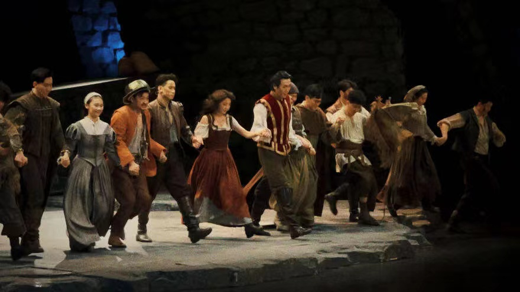

# 无厘头攻略

梧桐区是上海，外滩是上海，大学路也是上海，上海是千人千面的，它总有一个地方能让你共鸣。

## 杨浦-大学路 🐱‍💻

> 地铁 10 号线，江湾体育场站。

大学路就是大学生很多的路，无论是谁，只要来了就是大学生。大学路一头是创智天地，也就是去 bilibili 的方向，另一头是复旦和上财。什么？你说同济在哪？不知道，没听说过。

### 心碎男孩收容中心-24h

快看我发现了什么！欸嘿，欸嘿嘿 🤩🥳🥰

<!--  -->

oh sh*t，看了下简介，居然是一家正经店铺，这不是封面欺诈吗！

这家店可以打麻将、唱歌、桌游、游戏，是个多功能娱乐室，还是蛮比较适合聚会的。

### PD KITCHEN 西餐酒吧

20 年的时候从杭州回到上海，当时老同学小聚，他们带我去了这家店（应该没记错吧应该😶），这店挺适合坐下来聊天的，分店内店外，晚上还有人驻唱，现在这个季节，傍晚太阳落下，微风吹起来，应该会挺舒服。

网络推荐菜（有锅我不背，都是网上推荐的）：

- **🍖木熏牛胸肉**：说是招牌必点
- **🍟蓝波芝士薯条**：我不管，汉堡王薯条最好吃！
- **🍹伯爵茶**：不能喝酒去小孩子那桌！i
- **松饼🍪、牛肉丸(icon not found)**：那句话怎么说的来着，名字越简单，越好吃。

<!--  -->

### 生活如沸，顺德水牛奶火锅

貌似是 B 站开的店，带工牌可以打 8 折还是 88 折来着。

- **水牛奶冬阴功**：感觉奇奇怪怪的，平时只有在玩塞尔达的时候才会拿牛奶当食材🤔
- **红糖糍粑**：想吃，馋了
- **芒果牛奶雪花冰**：不知道，看腻了，小电视冰块我不吃

<!--  -->

### 开心麻花

> 虹口区

**疯狂理发店**、**赝品拍卖师**：开心麻花真的挺好看的，不管是电影还是剧场，开心就完事了。

<!--  -->

## 黄浦-人广 🐱‍👓

### glu 面包店

> 思南路 30 号，新开的红色面包店

“新鲜的面包放在桌上，灵魂将会穿梭如风，而我们的忧愁将被打扫干净”

<!--  -->

### NOFONO COFFEE

> 2 号线江苏路，新开的咖啡店

B 站刷到的探店，看到视频里店铺的装修风格非常喜欢，就收藏了。至于咖啡好不好喝，我也没喝过，让我几乎只喝拿铁的选手去看看他们家的拿铁~。

<!-- 
  -->

### 麻都·成都菜（人民广场店）

> 14 号线大世界站

新开的四川菜，人民广场试营。无辣不欢啊UU们，而且貌似吃小龙虾的季节到了，川湘菜冲就完了。
冲冲冲 🍤🌶🌶🌶🚴‍♂️

| 图一                        | 图二                                      |
| :-------------------------- | :---------------------------------------- |
|  |  |

<!-- ### 上海大剧院

> 2 号线人民广场站

- **剧院魅影**：经典音乐剧，据说是第一次以中文的形式演出，非常火爆。看了下档期到 6.4 号就结束了，而且周末票价好像是 600 多一个人。想看，但感觉可能不太好约。

- **恋爱的犀牛**：谁不喜欢爱情故事呢。大学话剧社演出，室友抢到了票，人生第一次看话剧，当时是真的很震撼，台词句句戳心，佩服话剧社的同学。不太确定这个版本的好不好看，档期也是 6.4 号，不是很贵。

 -->

### 二次元“破产街”

> 人民广场地铁站，香港名店街

这里各种二级元聚集，二次元店铺，还有很多人摆地摊的。之所以叫“破产街”，就是如果你不小心踩到别人摆摊的东西，可能会破产。听说这里有很多富婆（不是）🤫

 (假装有图.jpg)

### 上音歌剧院

> 汾阳路 6 号

**我，堂吉诃德**：“出发，桑丘·潘萨，我们一起去救杜尔西内亚公主”。档期 6.16-6.18，480 一张

<!--  -->

### 梵高星空艺术馆

> 南京东路第一百货中心 C 馆 8 楼

> 冷知识：梵高曾用剃须刀割下了自己的一只耳朵。他自杀时一共往脑袋开了两枪。

来感受一下梵高的艺术~

<!--  -->

## 浦东 🐱‍🏍

### PK（浦东店）

> 2号线龙阳路站

差不多一百多一个人，保龄球、桌球、飞镖、射箭、舞力全开，感觉会很好玩的样子

<!--  -->

### 羽毛球 o((>ω< ))o

我记得说过要约羽毛球的！！！

<!--  -->